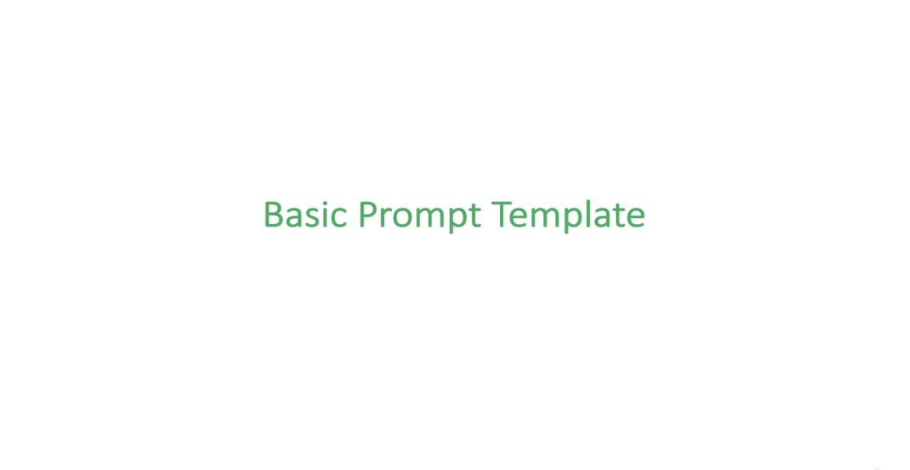
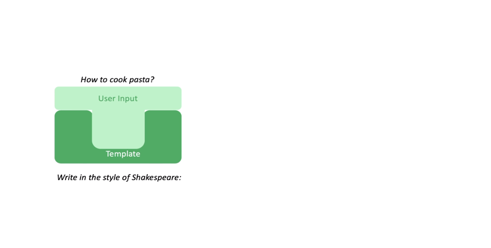
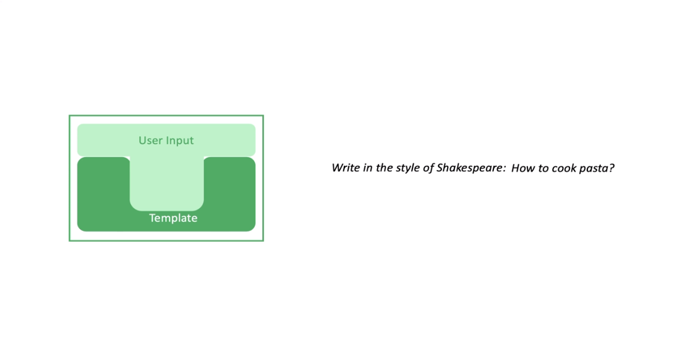
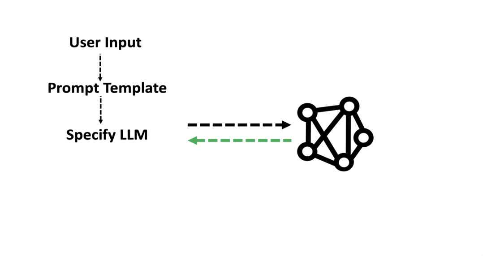

# Section 3 Prompts and Prompt Templates

## 6. A Simple Chat GPT Clone

## 7. Prompt Templates

### [FlowGPT](https://flowgpt.com/)

### [How-does-chatgpt-token-work](https://zapier.com/blog/how-does-chatgpt-work/#:~:text=side%20of%20things.-,Tokens,-How%20text%20is)

### [Frequency and Presence penalties](https://www.twilio.com/blog/ultimate-guide-openai-gpt-3-language-model#:~:text=to%20remove%20it.-,Temperature,-One%20of%20the)

FlowGPT is a platform that allows users to create AI prompts that can generate text, translate languages, and write creative content.

## 8. Multi-Input Prompt Templates

## 9. Chat Prompt Template

## 10. Few Shot Prompt Templates
