# Section 1 LangChain Basics, and Why LangChain is Awesome!

## No-Code LangChain

- We start with Installation of Flowise and Lang Flow on Render and Railway. One could also install locally.

## 2. Introduction to LangChain

- [discord server](https://discord.com/invite/yGZBqwXEn7)
- [langchain](https://www.langchain.com/)

### LangChain

- Prompt Template
- Chains
- Models
- Retrievers
- Agents
- Tools
- Output Parsers
- Memory

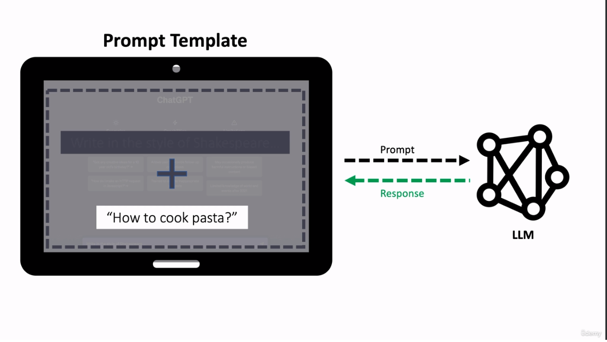

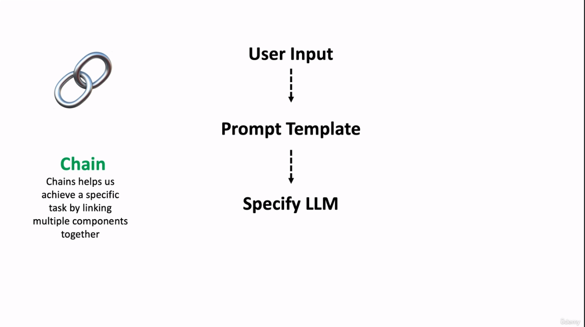

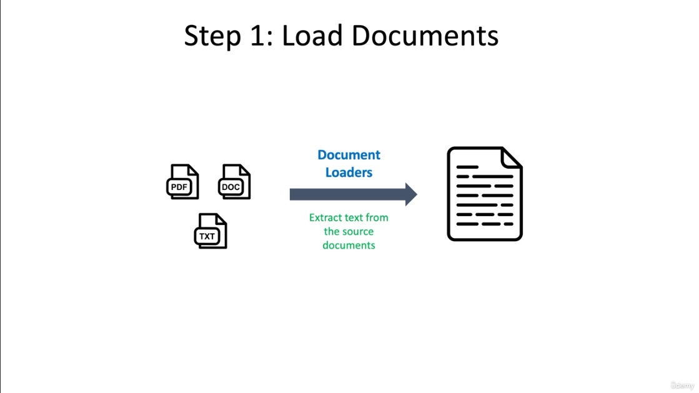

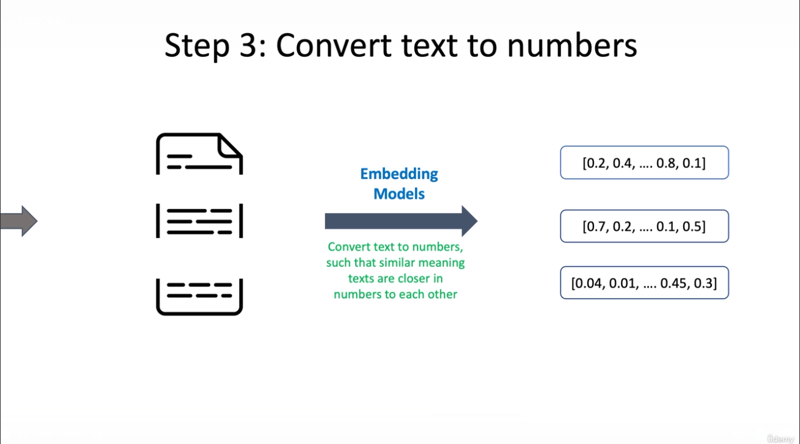

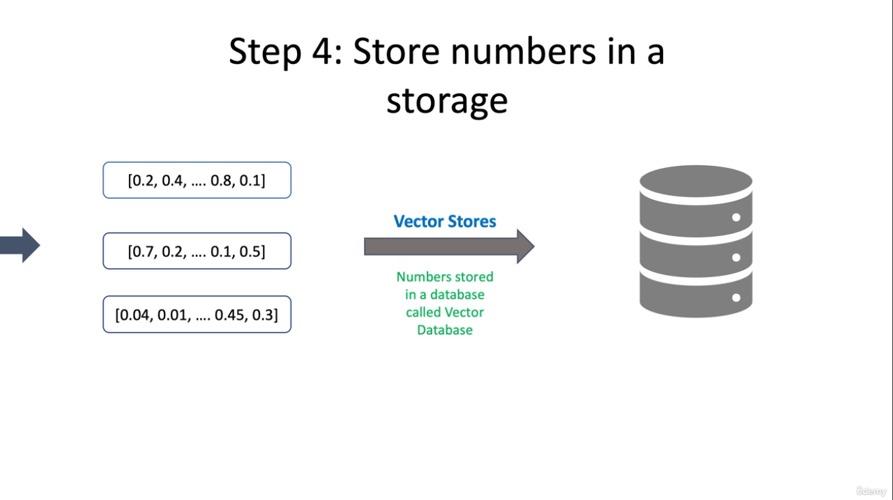

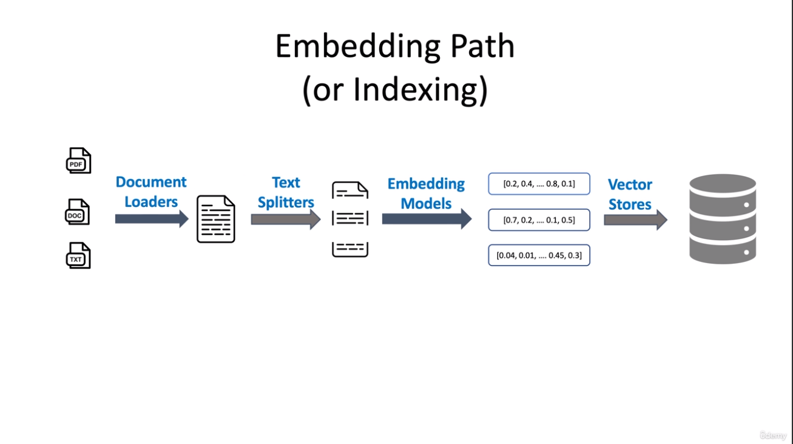

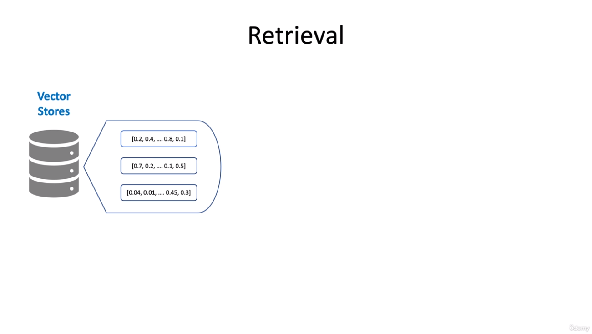

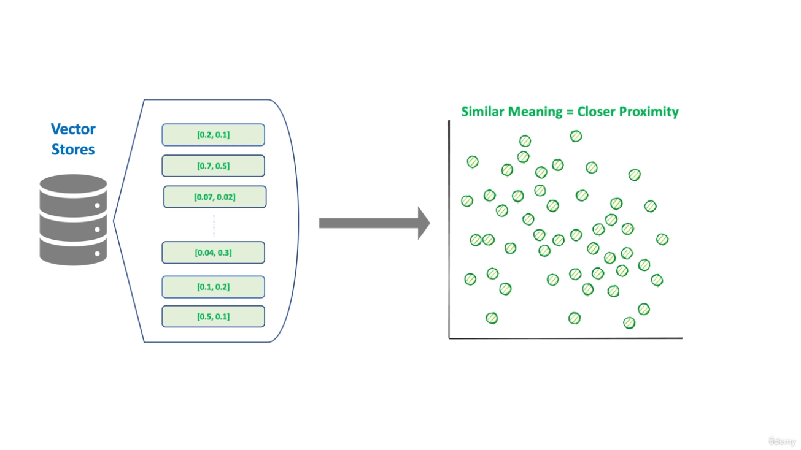

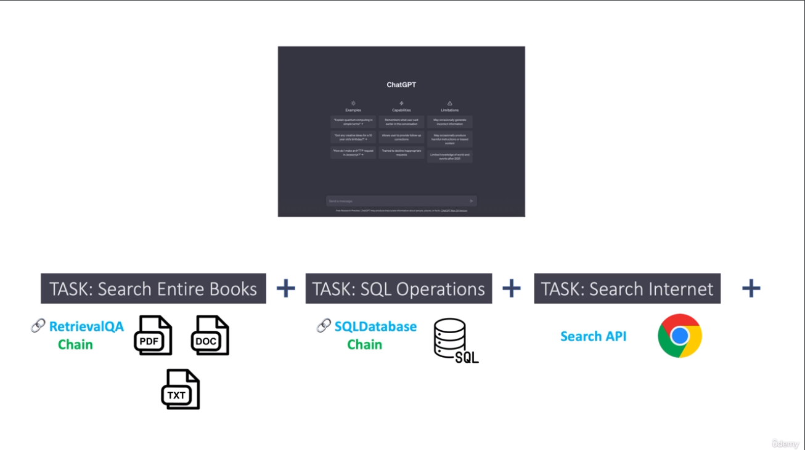

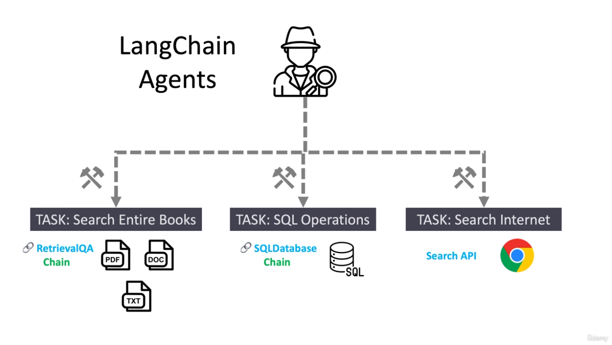

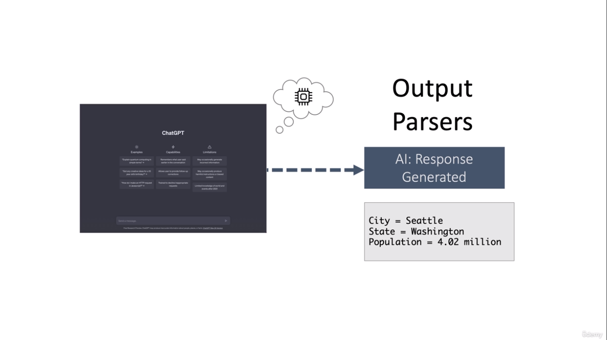